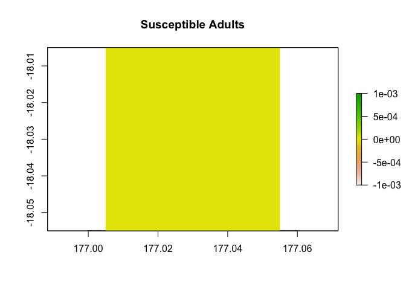
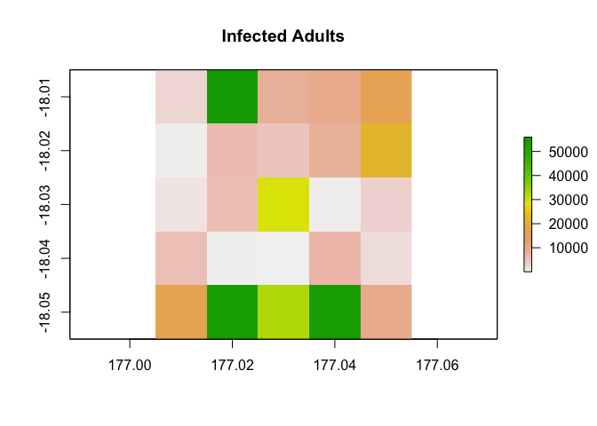

<!-- README.md is generated from README.Rmd. Please edit that file -->

# epizootic 

<!-- badges: start -->

[](https://github.com/viralemergence/epizootic/actions/workflows/R-CMD-check.yaml)
[](https://CRAN.R-project.org/package=epizootic)
[](https://CRAN.R-project.org/package=epizootic)
[](https://github.com/viralemergence/epizootic/commits/master)
<!-- badges: end -->

`epizootic` is an extension to `poems`, a spatially-explicit,
process-explicit, pattern-oriented framework for modeling population
dynamics. This extension adds functionality for modeling disease
dynamics in wildlife. It also adds capability for seasonality and for
unique dispersal dynamics for each life cycle stage.

## Installation

You can install the latest release on CRAN with:

``` r
install.packages("epizootic")
```

You can install the latest version of epizootic from
[GitHub](https://github.com/) with:

``` r
# install.packages("devtools")
install.packages("poems")
devtools::install_github("viralemergence/epizootic")
```

Because `epizootic` is an extension to `poems`, it is necessary to
install `poems` first.

## About R6 classes

`poems` and `epizootic` run on
[R6](https://r6.r-lib.org/articles/Introduction.html) classes. R is
primarily a *functional* programming language in which the primary units
of programming are expressions and functions. Here we use R6 to create
an *object-oriented* framework inside of R. R6 classes such as
`DiseaseModel` and `SimulationHandler` are used to store model
attributes, check them for consistency, pass them to parallel sessions
for simulation, and gather results and errors.

## Example

Here is the initial state of an idealized theoretical disease scenario,
following a SIR disease model with three life cycle stages: juvenile,
yearling, and adult.

``` r
library(poems)
library(purrr)
library(epizootic)
example_region <- Region$new(coordinates = data.frame(x = rep(seq(177.01, 177.05, 0.01), 5),
                             y = rep(seq(-18.01, -18.05, -0.01), each = 5)))
initial_abundance <- c(c(5000, 5000, 5000, 1, 0, 0, 0, 0, 0),
                          rep(c(5000, 5000, 5000, 0, 0, 0, 0, 0, 0), 24)) |>
      matrix(nrow = 9)
example_region$raster_from_values(initial_abundance[3,]) |>
  raster::plot(main = "Susceptible Adults")
```


``` r
example_region$raster_from_values(initial_abundance[4,]) |>
  raster::plot(main = "Infected Juveniles")
```


Here I create a `DiseaseModel` object, which stores inputs for disease
simulations and checks them for consistency and completeness.

``` r
model_inputs <- DiseaseModel$new(
  time_steps = 10,
    seasons = 2,
    populations = 25,
    stages = 3,
    compartments = 3, # indicates disease compartments
    region = example_region,
    initial_abundance = initial_abundance,
    # Dimensions of carrying_capacity are populations by timesteps
    carrying_capacity = matrix(100000, nrow = 25, ncol = 10),
    # Indicates length of breeding season in days for each population
    breeding_season_length = rep(100, 25),
    # One mortality value for each stage and compartment
    mortality = c(0.4, 0.2, 0, 0.505, 0.25, 0.105, 0.4, 0.2, 0),
    # Indicates that these are seasonal mortality values
    mortality_unit = 1,
    # No reproduction in this simple example
    fecundity = 0,
    fecundity_unit = 1,
    fecundity_mask = rep(0, 9),
    # Transmission rates from infected individuals, one for each stage
    transmission = c(0.00002, 0.00001, 7.84e-06),
    # Indicates that these are daily transmission rates
    transmission_unit = 0,
    # Indicates that all stages in the first compartment, S, can be infected
    transmission_mask = c(1, 1, 1, 0, 0, 0, 0, 0, 0),
    recovery = c(0.05714286, 0.06, 0.1),
    recovery_unit = 0,
    # Indicates that all stages in the second compartment, I, can recover
    recovery_mask = c(0, 0, 0, 1, 1, 1, 0, 0, 0),
    season_functions = list(sir_model_summer, NULL), 
    dispersal = list(disperser),
    simulation_order = list(c("transition", "season_functions", "results"),
                            c("dispersal", "results")),
    verbose = F
)
model_inputs$is_complete()
#> [1] TRUE
model_inputs$is_consistent()
#> [1] TRUE
```

The core simulation engine of `epizootic` is the function
`disease_simulator`, which simulates spatially explicit disease dynamics
in populations. Here I show the results from the non-breeding season in
the tenth year of the simulation.

``` r
results <- disease_simulator(model_inputs)
results$abundance_segments$stage_3_compartment_1[,10,2] |>
  example_region$raster_from_values() |>
  raster::plot(main = "Susceptible Adults")
```



``` r
results$abundance_segments$stage_3_compartment_2[,10,2] |>  
  example_region$raster_from_values() |>
  raster::plot(main = "Infected Adults")
```


