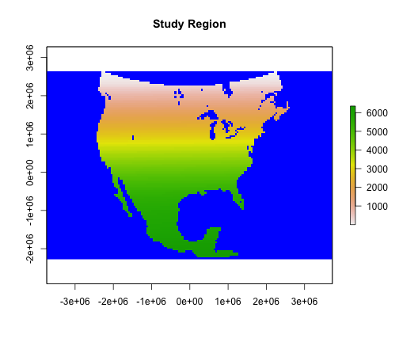
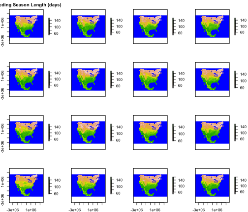
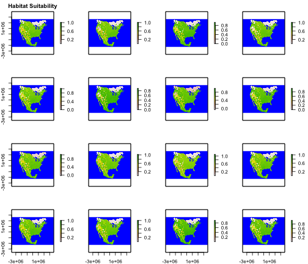
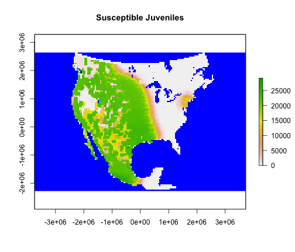
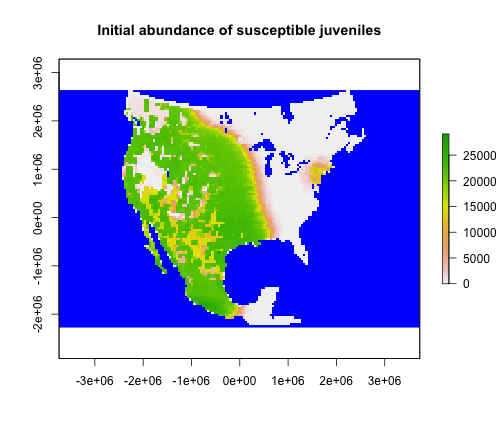
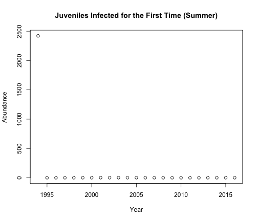
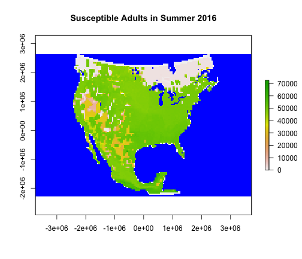

# Background

House finch conjunctivitis, caused by the bacterium *Mycoplasma gallisepticum*, blazed a devastating trail through eastern populations of the house finch *Haemorhous mexicanus* when it first emerged in 1994. In this vignette, we will run a simulation of this epizootic.

Please note that this is just an example and is not meant to accurately represent the disease dynamics of house finch conjunctivitis.

# Setup

First, we load `epizootic` and set the number of simulations. For the purposes  of this vignette, it will be one simulation, but if you want to try running more on your own, you can increase the number. We also set `parallel_cores` to 1 so the simulations run sequentially, but if you want to run them in parallel for yourself, just increase the number. We will run the simulation for 23 timesteps.


```r
library(poems)
library(epizootic)
nsims <- 1
parallel_cores <- 1
timesteps <- 23
```

Then, we load the **region object**. This is crucial to any `epizootic` simulation, as it defines the study region in space.


```r
library(raster)
epizootic::finch_region
#> class      : RasterLayer 
#> dimensions : 106, 161, 17066  (nrow, ncol, ncell)
#> resolution : 46375.21, 46375.21  (x, y)
#> extent     : -3741268, 3725142, -2277277, 2638496  (xmin, xmax, ymin, ymax)
#> crs        : +proj=aea +lat_0=34.5 +lon_0=-94.5 +lat_1=21.5 +lat_2=47.5 +x_0=0 +y_0=0 +datum=WGS84 +units=m +no_defs 
#> source     : memory
#> names      : layer 
#> values     : 1, 6355  (min, max)
region <- Region$new(template_raster = finch_region)
raster::plot(region$region_raster, colNA = "blue",
             main = "Study Region")
```



We also need to load in data on the breeding season length of the house finch, which will define the season lengths of the simulation throughout the house finch range.


```r
data("bsl_raster")
raster::plot(bsl_raster, colNA = "blue",
             main = "Breeding Season Length (days)")
```



Here we load data on habitat suitability for the house finch in North America from 1994 to 2016. Habitat suitability is scored from 0 to 1, where 1 is the most suitable.


```r
data("habitat_suitability")
raster::plot(habitat_suitability, colNA = "blue",
             main = "Habitat Suitability")
```



Finally, we will load an initial abundance of house finches to start the simulation in 1994. I generated this initial abundance in a preliminary round of population modeling, and I cannot guarantee that it accurately reflects real house finch abundances in 1994.


```r
data("initial_abundance")
region$raster_from_values(initial_abundance[1, ]) |>
  raster::plot(colNA = "blue", main = "Susceptible Juveniles")
```



Note that this initial abundance is not ready to be entered into the simulation, because we must first add infected individuals in Washington, D.C., which is where the first house finches with symptoms were observed. We will do this in step 3, below.

## Step 1: Fixed parameters

The `DiseaseModel` object stores fixed parameters: model parameters that do not change from simulation to simulation. These determine some very important settings for the simulation.


```r
model_template <- DiseaseModel$new(
  simulation_function = "disease_simulator",
  region = region,
  time_steps = timesteps,
  populations = region$region_cells,
  replicates = 1,
  stages = 2, # life cycle stages
  compartments = 4, # disease compartments
  seasons = 2, # seasons in a year
  mortality_unit = list(c(1, 1, 0, 0, 1, 1, 0, 0), # is mortality seasonal
                        c(1, 1, 0, 0, 1, 1, 0, 0)), # or daily?
  fecundity_unit = rep(1, 8), # is fecundity seasonal or daily?
  fecundity_mask = rep(c(0, 1), 4), # which stages/compartments reproduce
  transmission_unit = rep(0, 4), # Is transmission rate seasonal or daily?
  transmission_mask = c(1, 1, 0, 0, 1, 1, 0, 0), # which compartments can become                                                  # infected
  recovery_unit = rep(0, 4), # is recovery rate seasonal or daily?
  recovery_mask = c(0, 0, 1, 1, 0, 0, 1, 1), # which compartments can recover
  breeding_season_length = bsl_raster,
  hs = habitat_suitability,
  abundance = initial_abundance,
  dispersal_type = "stages", # indicates that life cycle stages disperse
                             # differently
  simulation_order = list(c("transition", "season_functions", "results"),
                          c("dispersal", "season_functions", "results")),
  results_selection = c("abundance"), # what do want included in the result?
  results_breakdown = "segments", # are the results broken down by life cycle
                                  # stage, disease compartment, or both?
  season_functions = list(siri_model_summer, siri_model_winter),
  verbose = FALSE,
  random_seed = 648,
  attribute_aliases = list(
    mortality_Sj_summer = "mortality$summer$a",
    mortality_Sa_summer = "mortality$summer$b",
    mortality_I1j_summer = "mortality$summer$c",
    mortality_I1a_summer = "mortality$summer$d",
    mortality_Rj_summer = "mortality$summer$e",
    mortality_Ra_summer = "mortality$summer$f",
    mortality_I2j_summer = "mortality$summer$g",
    mortality_I2a_summer = "mortality$summer$h",
    mortality_Sj_winter = "mortality$winter$a",
    mortality_Sa_winter = "mortality$winter$b",
    mortality_I1j_winter = "mortality$winter$c",
    mortality_I1a_winter = "mortality$winter$d",
    mortality_Rj_winter = "mortality$winter$e",
    mortality_Ra_winter = "mortality$winter$f",
    mortality_I2j_winter = "mortality$winter$g",
    mortality_I2a_winter = "mortality$winter$h",
    beta_Sj_summer = "transmission$summer$a",
    beta_Sa_summer = "transmission$summer$b",
    beta_Rj_summer = "transmission$summer$c",
    beta_Ra_summer = "transmission$summer$d",
    beta_Sj_winter = "transmission$winter$a",
    beta_Sa_winter = "transmission$winter$b",
    beta_Rj_winter = "transmission$winter$c",
    beta_Ra_winter = "transmission$winter$d",
    recovery_I1j_summer = "recovery$summer$a",
    recovery_I1a_summer = "recovery$summer$b",
    recovery_I2j_summer = "recovery$summer$c",
    recovery_I2a_summer = "recovery$summer$d",
    recovery_I1j_winter = "recovery$winter$a",
    recovery_I1a_winter = "recovery$winter$b",
    recovery_I2j_winter = "recovery$winter$c",
    recovery_I2a_winter = "recovery$winter$d",
    dispersal1 = "dispersal$a",
    dispersal2 = "dispersal$b"
  )
)
```

We can test whether the DiseaseModel object is complete (has everything it needs for simulation) and consistent (all inputs are consistent with each other and will not throw errors in the simulator function.)


```r
model_template$is_complete()
#> [1] FALSE
model_template$is_consistent()
#> [1] TRUE
```

## Step 2: Variable parameters

Some of the parameters will vary from simulation to simulation. We are going to run only one simulation for this example, but we will go through the process of generating a stratified sample so that if you want to run this vignette on your own with more than one simulation, you will get a sample of variable parameters appropriate to your number of simulations.

Latin Hypercube Sampling, which comes to us from the LatinHypercubeSampler class in `poems`, allows us to thoroughly sample across parameter space in a balanced way.


```r
lhs_generator <- LatinHypercubeSampler$new()

# Dispersal parameters
lhs_generator$set_beta_parameter("dispersal_p_juv", alpha = 9.834837,
                                 beta = 2.019125)
lhs_generator$set_beta_parameter("dispersal_p_adult", alpha = 1.5685,
                                 beta = 2.365266)
lhs_generator$set_truncnorm_parameter("dispersal_r_juv", lower = 0, upper = 1500,
                                      mean = 725.9071, sd = sqrt(204006.6))
lhs_generator$set_normal_parameter("dispersal_r_adult", mean = 679.4172,
                                   sd = sqrt(18594.59))
lhs_generator$set_uniform_parameter("dispersal_source_n_k_cutoff", lower = 0,
                                    upper = 1)
lhs_generator$set_uniform_parameter("dispersal_source_n_k_threshold", lower = 0,
                                    upper = 1)
lhs_generator$set_uniform_parameter("dispersal_target_n_k_cutoff", lower = 0,
                                    upper = 1)
lhs_generator$set_uniform_parameter("dispersal_target_n_k_threshold", lower = 0,
                                    upper = 1)

# Population growth parameters
lhs_generator$set_uniform_parameter("abundance_threshold", lower = 0, upper = 25, decimals = 0)
lhs_generator$set_uniform_parameter("initial_release", lower = 5, upper = 50, decimals = 0)
lhs_generator$set_uniform_parameter("density_max", lower = 186000, upper = 310000, decimals = 0)
lhs_generator$set_poisson_parameter("fecundity", lambda = 8.509018)

# Transmission parameters
lhs_generator$set_uniform_parameter("beta_Sa_winter", lower = 0, upper = 0.07588)
lhs_generator$set_uniform_parameter("beta_Sa_summer", lower = 0, upper = 0.007784)
lhs_generator$set_triangular_parameter("Sj_multiplier", lower = 0, upper = 8.5,
                                       mode = 3)
lhs_generator$set_beta_parameter("beta_I2_modifier", alpha = 1.547023,
                                 beta = 0.4239236)

# Mortality parameters
lhs_generator$set_beta_parameter("mortality_Sj_winter", alpha = 3.962104,
                                 beta = 2.228683)
lhs_generator$set_beta_parameter("mortality_Sa_winter", alpha = 21.89136,
                                 beta = 19.59278)
lhs_generator$set_beta_parameter("mortality_Sj_summer", alpha = 14.51403,
                                 beta = 21.53632)
lhs_generator$set_beta_parameter("mortality_I1j_summer", alpha = 2.756404,
                                 beta = 62.47181)
lhs_generator$set_beta_parameter("mortality_I1j_winter", alpha = 2.756404,
                                 beta = 62.47181)
lhs_generator$set_beta_parameter("mortality_I1a_summer", alpha = 1.771183,
                                 beta = 27.19457)
lhs_generator$set_beta_parameter("mortality_I1a_winter", alpha = 1.678424,
                                 beta = 41.15975)
lhs_generator$set_beta_parameter("mortality_I2_modifier", alpha = 1.033367,
                                 beta = 3.505319)

# Recovery parameters
lhs_generator$set_beta_parameter("recovery_I1", alpha = 9.347533,
                                 beta = 620.1732)
lhs_generator$set_beta_parameter("recovery_I2", alpha = 1.181112,
                                 beta = 29.18489)

# How many birds are infected in DC at timestep 1?
lhs_generator$set_uniform_parameter("infected_t1", lower = 1, upper = 20, decimals = 0)

sample_data <- lhs_generator$generate_samples(number = nsims,
                        random_seed = 630)
sample_data$sample <- 1:nsims
sample_data$mortality_Sa_summer <- 0
sample_data$mortality_I2j_summer <- sample_data$mortality_I2_modifier * sample_data$mortality_I1j_summer
sample_data$mortality_I2j_winter <- sample_data$mortality_I2_modifier * sample_data$mortality_I1j_winter
sample_data$mortality_I2a_winter <- sample_data$mortality_I2_modifier * sample_data$mortality_I1a_winter
sample_data$mortality_I2a_summer <- sample_data$mortality_I2_modifier * sample_data$mortality_I1a_summer
sample_data$mortality_Rj_summer <- sample_data$mortality_Sj_summer
sample_data$mortality_Ra_summer <- sample_data$mortality_Sa_summer
sample_data$mortality_Rj_winter <- sample_data$mortality_Sj_winter
sample_data$mortality_Ra_winter <- sample_data$mortality_Sa_winter
sample_data
#>   dispersal_p_juv dispersal_p_adult dispersal_r_juv
#> 1       0.9085645         0.5570444        1111.798
#>   dispersal_r_adult dispersal_source_n_k_cutoff
#> 1          797.6146                  0.08639626
#>   dispersal_source_n_k_threshold
#> 1                      0.9124628
#>   dispersal_target_n_k_cutoff
#> 1                   0.6448534
#>   dispersal_target_n_k_threshold abundance_threshold
#> 1                      0.6230523                  21
#>   initial_release density_max fecundity beta_Sa_winter
#> 1              48      244195        10     0.03850449
#>   beta_Sa_summer Sj_multiplier beta_I2_modifier
#> 1    0.006361316      2.010013        0.4393239
#>   mortality_Sj_winter mortality_Sa_winter
#> 1           0.8122868           0.6056517
#>   mortality_Sj_summer mortality_I1j_summer
#> 1           0.2705237           0.01327702
#>   mortality_I1j_winter mortality_I1a_summer
#> 1           0.04812851           0.01720863
#>   mortality_I1a_winter mortality_I2_modifier recovery_I1
#> 1           0.05787949             0.3012527  0.01662016
#>    recovery_I2 infected_t1 sample mortality_Sa_summer
#> 1 0.0005477506          19      1                   0
#>   mortality_I2j_summer mortality_I2j_winter
#> 1           0.00399974           0.01449885
#>   mortality_I2a_winter mortality_I2a_summer
#> 1           0.01743635          0.005184147
#>   mortality_Rj_summer mortality_Ra_summer
#> 1           0.2705237                   0
#>   mortality_Rj_winter mortality_Ra_winter
#> 1           0.8122868           0.6056517
```

## Step 3: Generators

In the poemsverse, generators are modules that can, given the right inputs, dynamically generate complex outputs for each simulation.

### 3a. Dispersal

In `epizootic` we can use dispersal generators to generate dispersal rates among populations for each simulation. First, we will create a `SpatialCorrelation` object to make sure the dispersal rates are realistically spatially correlated.


```r
env_corr <- SpatialCorrelation$new(region = region,
                                   amplitude = 0.99,
                                   breadth = 850,
                                   distance_scale = 1000)
env_corr$calculate_compact_decomposition(decimals = 4)
#> Warning: No coordinate reference system (CRS) specified:
#> assuming coordinates are in meters
```

Next, we will create a dispersal generator for adult dispersal. We are modeling adult and juvenile dispersal separately because in house finches, juveniles disperse more.


```r
b_lookup <- data.frame(d_max = -Inf, b = 0:904)
for (i in 2:904) {
  b_lookup$d_max[i] <- which.max(exp(-1*(1:1501)/b_lookup$b[i]) <= 0.19)
}
b_lookup$d_max[905] <- 1501

adult_dispersal_gen <- DispersalGenerator$new(
  region = region,
  spatial_correlation = env_corr,
  distance_classes = seq(10, 1500, 10),
  distance_scale = 1000, # km
  dispersal_function_data = b_lookup,
  inputs = c("dispersal_p_adult",
             "dispersal_r_adult"),
  attribute_aliases = list(dispersal_r_adult = "dispersal_max_distance",
                           dispersal_p_adult = "dispersal_proportion",
                           dispersal_adult = "dispersal_data"),
  decimals = 3
)
# This stage is computationally intensive
distance_matrix <- adult_dispersal_gen$calculate_distance_matrix()
#> Warning: No coordinate reference system (CRS) specified:
#> assuming coordinates are in meters
adult_dispersal_gen$calculate_distance_data(distance_matrix = distance_matrix)
```

And now we will create a dispersal generator for juveniles. Here we can reuse the distance data from the previous step because the distances among populations are always the same, regardless of whether the dispersers are adults or juveniles.


```r
juvenile_dispersal_gen <- DispersalGenerator$new(
  region = region,
  spatial_correlation = env_corr,
  distance_classes = seq(10, 1500, 10),
  distance_scale = 1000, # km
  dispersal_function_data = b_lookup,
  decimals = 3,
  inputs = c("dispersal_p_juv",
             "dispersal_r_juv"),
  attribute_aliases = list(dispersal_r_juv = "dispersal_max_distance",
                 dispersal_p_juv = "dispersal_proportion",
                 dispersal_source_n_k_cutoff = "dispersal_source_n_k$cutoff",
                 dispersal_juv = "dispersal_data"),
  decimals = 3
)
juvenile_dispersal_gen$distance_data <- adult_dispersal_gen$distance_data
```

### 3b. Carrying Capacity and Initial Abundance

Here will use a generator to create a carrying capacity (based on habitat suitability and maximum population density of house finches) and an initial abundance (initial abundance plus introduced infection in Washington, D.C.) for each simulation.


```r
capacity_gen <- Generator$new(
  description = "capacity",
  region = region,
  generate_rasters = FALSE,
  time_steps = timesteps,
  generative_requirements = list(
    initial_abundance = "function",
    carrying_capacity = "function"
  ),
  inputs = c("density_max", "hs", "abundance", "infected_t1"),
  outputs = c("initial_abundance", "carrying_capacity")
)
# Here we subset the habitat suitability raster to have only the region cells,
# and we add the burn in. Also, we tell the generator to generate the
# carrying_capacity based on "density_max" and "hs".
capacity_gen$add_function_template(
  param = "carrying_capacity",
  function_def = function(params) {
    hs_matrix <- params$hs |> as.matrix() |>
      _[params$region$region_indices, 1:params$time_steps]
    hs_matrix[!is.finite(hs_matrix)] <- 0
    # round the density values
    round(params$density_max * hs_matrix)
  },
  call_params = c("density_max", "hs", "region",
                  "time_steps")
)
# Here we tell the generator what function to use to generate initial_abundance
# based on the number of finches first infected in Washington, D.C.
capacity_gen$add_function_template(
  param = "initial_abundance",
  function_def = function(params) {
    abundance <- params$abundance
    infected_adults <- round(runif(1, 0, params$infected_t1))
    infected_juv <- params$infected_t1 - infected_adults
    abundance[3, 3531] <- infected_juv
    abundance[4, 3531] <- infected_adults
    return(abundance)
  },
  call_params = c("abundance", "infected_t1")
)

test_capacity <- capacity_gen$generate(input_values = list(density_max = 186000, infected_t1 = 5, hs = habitat_suitability, abundance = initial_abundance))

raster::plot(
  region$raster_from_values(test_capacity[[1]][1,]),
  main = "Initial abundance of susceptible juveniles",
  colNA = "blue"
)
```



# Simulation

In `epizootic` it is often convenient to manage simulations using `SimulationHandler`, an object that can bring the model template, data frame of variable parameters, and generators all into one place and make sure they interact smoothly. `SimulationHandler` can also run simulations in parallel, though for this example we will run sequentially. You can change this behavior by increasing the number of `parallel_cores`.


```r
handler <- SimulationHandler$new(
  sample_data = sample_data,
  model_template = model_template,
  generators = list(juvenile_dispersal_gen,
                    adult_dispersal_gen,
                    capacity_gen),
  parallel_cores = parallel_cores,
  results_dir = tempdir()
)
sim_log <- handler$run()
sim_log$summary
#> [1] "1 of 1 sample models ran and saved results successfully"
```

The simulation log, `sim_log`, can be examined for error messages and failure indices if any of the simulations fail. There is also a detailed simulation log created in the output directory.

# Results

Let's take a look at the results of the simulation.


```r
results <- qs::qread(file.path(tempdir(), "sample_1_results.qs"))
str(results)
#> List of 3
#>  $ all               :List of 2
#>   ..$ abundance         : num [1:23, 1:2] 4.87e+08 5.40e+08 5.89e+08 6.38e+08 6.94e+08 ...
#>   ..$ abundance_segments:List of 8
#>   .. ..$ stage_1_compartment_1: num [1:23, 1:2] 3.55e+08 3.78e+08 4.10e+08 4.41e+08 4.82e+08 ...
#>   .. ..$ stage_2_compartment_1: num [1:23, 1:2] 1.32e+08 1.62e+08 1.79e+08 1.96e+08 2.12e+08 ...
#>   .. ..$ stage_1_compartment_2: num [1:23, 1:2] 2421 0 0 0 0 ...
#>   .. ..$ stage_2_compartment_2: num [1:23, 1:2] 197 0 0 0 0 0 0 0 0 0 ...
#>   .. ..$ stage_1_compartment_3: num [1:23, 1:2] 0 0 0 0 0 0 0 0 0 0 ...
#>   .. ..$ stage_2_compartment_3: num [1:23, 1:2] 0 0 0 0 0 0 0 0 0 0 ...
#>   .. ..$ stage_1_compartment_4: num [1:23, 1:2] 0 0 0 0 0 0 0 0 0 0 ...
#>   .. ..$ stage_2_compartment_4: num [1:23, 1:2] 0 0 0 0 0 0 0 0 0 0 ...
#>  $ abundance         : num [1:6355, 1:23, 1:2] 0 0 0 0 0 0 0 0 0 0 ...
#>  $ abundance_segments:List of 8
#>   ..$ stage_1_compartment_1: num [1:6355, 1:23, 1:2] 0 0 0 0 0 0 0 0 0 0 ...
#>   ..$ stage_2_compartment_1: num [1:6355, 1:23, 1:2] 0 0 0 0 0 0 0 0 0 0 ...
#>   ..$ stage_1_compartment_2: num [1:6355, 1:23, 1:2] 0 0 0 0 0 0 0 0 0 0 ...
#>   ..$ stage_2_compartment_2: num [1:6355, 1:23, 1:2] 0 0 0 0 0 0 0 0 0 0 ...
#>   ..$ stage_1_compartment_3: num [1:6355, 1:23, 1:2] 0 0 0 0 0 0 0 0 0 0 ...
#>   ..$ stage_2_compartment_3: num [1:6355, 1:23, 1:2] 0 0 0 0 0 0 0 0 0 0 ...
#>   ..$ stage_1_compartment_4: num [1:6355, 1:23, 1:2] 0 0 0 0 0 0 0 0 0 0 ...
#>   ..$ stage_2_compartment_4: num [1:6355, 1:23, 1:2] 0 0 0 0 0 0 0 0 0 0 ...
```

As you can see here, the results generated by the simulation have a lot of parts. The `all` element provides a yearly summary of the results, where each row is a year and each column is a season. `results$all$abundance` provides a total, while `results$all$abundance_segments` gives a year/season summary for each combination of life cycle stage and disease compartment, like so:


```r
plot(y = results$all$abundance_segments$stage_1_compartment_2[, 1],
     x = 1994:2016,
     ylab = "Abundance", xlab = "Year",
     main = "Juveniles Infected for the First Time (Summer)")
```



This time series shows the outbreak rapidly fizzling out. The output above, which showed no recovered individuals in subsequent timesteps, indicates that all the juveniles who acquired the disease died, halting its spread.

You can also get un-summarized, spatially explicit information. `results$abundance` gives the total abundance by year and season for each population, and `results$abundance_segments` breaks it down by life cycle stage and disease compartment. You can visualize that like this:


```r
region$raster_from_values(results$abundance_segments$stage_2_compartment_1[ , 23, 1]) |>
  raster::plot(colNA = "blue", main = "Susceptible Adults in Summer 2016")
```



There are many possibilities for what you can do with these results. You could make maps for each time step and glue them together into a gif or video using `gganimate`. You could use spatial statistics to investigate how continuous or discontinuous the outbreak areas are. You could use the `Validator` object from the `poems` package to perform pattern-oriented modeling on the results. You can learn more about how to do that in the `poems`
[vignette](https://cran.r-project.org/web//packages/poems/vignettes/thylacine_example.pdf).
