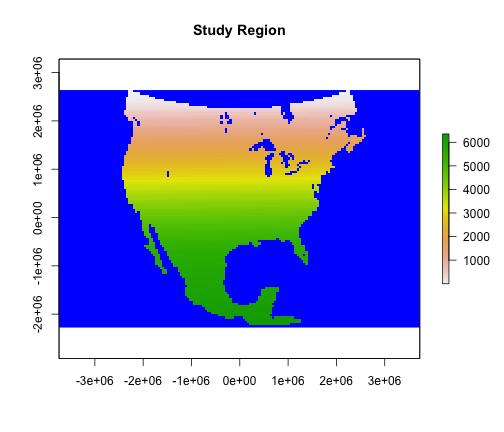
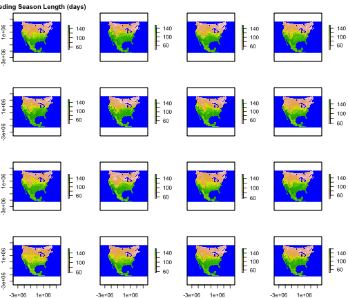

# Background

House finch conjunctivitis, caused by the bacterium *Mycoplasma gallisepticum*, blazed a devastating trail through eastern populations of the house finch *Haemorhous mexicanus* when it first emerged in 1994. In this vignette, we will run a simulation of this epizootic.

Please note that this is just an example and is not meant to accurately represent the disease dynamics of house finch conjunctivitis.

# Setup

First, we load `epizootic` and set the number of simulations. For the purposes  of this vignette, it will be one simulation, but if you want to try running more on your own, you can increase the number. We also set `parallel_cores` to 1 so the simulations run sequentially, but if you want to run them in parallel for yourself, just increase the number. We will run the simulation for 23 timesteps.


``` r
library(poems)
library(epizootic)
nsims <- 1
parallel_cores <- 1
timesteps <- 23
```

Then, we load the **region object**. This is crucial to any `epizootic` simulation, as it defines the study region in space.


``` r
library(raster)
#> Loading required package: sp
epizootic::finch_region
#> class      : RasterLayer 
#> dimensions : 106, 161, 17066  (nrow, ncol, ncell)
#> resolution : 46375.21, 46375.21  (x, y)
#> extent     : -3741268, 3725142, -2277277, 2638496  (xmin, xmax, ymin, ymax)
#> crs        : +proj=aea +lat_0=34.5 +lon_0=-94.5 +lat_1=21.5 +lat_2=47.5 +x_0=0 +y_0=0 +datum=WGS84 +units=m +no_defs 
#> source     : memory
#> names      : layer 
#> values     : 1, 6355  (min, max)
region <- Region$new(template_raster = finch_region)
raster::plot(region$region_raster, colNA = "blue",
             main = "Study Region")
```



We also need to load in data on the breeding season length of the house finch, which will define the season lengths of the simulation throughout the house finch range.


``` r
data("bsl_raster")
raster::plot(bsl_raster, colNA = "blue",
             main = "Breeding Season Length (days)")
```



Here we load data on habitat suitability for the house finch in North America from 1994 to 2016. Habitat suitability is scored from 0 to 1, where 1 is the most suitable.


